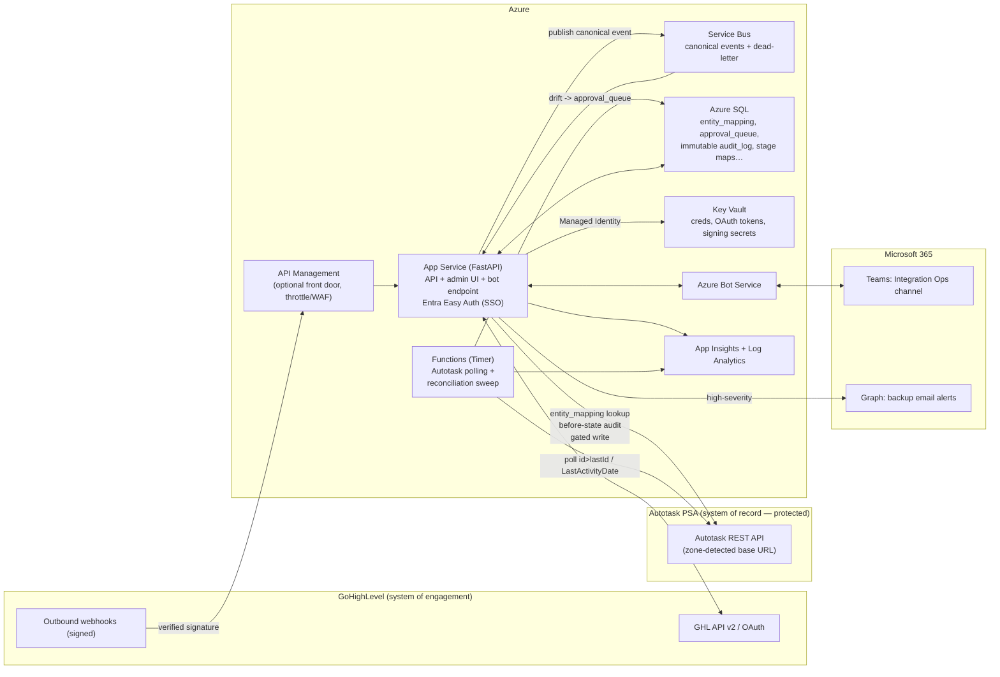

# Architecture

## Component & data-flow diagram

**Forward path (GHL → Autotask):** GHL webhook → (API Management →) App Service → Service Bus →
worker → `entity_mapping` lookup → **gated** Autotask write (with before-state audit).
**Reverse path (Autotask → GHL):** Timer-triggered Functions poll Autotask (no comprehensive
webhooks) → publish canonical event → push to GHL.

## Why each Azure service (Spec §12.2)

| Concern | Service | Why |
|---|---|---|
| Compute / API / bot endpoint / admin UI | **App Service (Web App)** | Hosts FastAPI + admin config UI + bot messaging endpoint. **Entra "Easy Auth"** gives admin-tool SSO with almost no code. |
| Polling & reconciliation | **Functions (Timer-triggered)** | Autotask has no comprehensive webhooks → outbound changes **must** be polled; the reconciliation sweep runs here. |
| Durable event queue | **Service Bus** | Dead-letter + retry guarantee no event is lost — directly supports "the record cannot be damaged." |
| Database | **Azure SQL** | `entity_mapping`, `approval_queue`, immutable `audit_log`, stage maps. Postgres locally → Azure SQL on deploy (§3.4). |
| Secrets | **Key Vault** | All API creds, OAuth tokens, signing secrets; app reads via **Managed Identity** (no secrets stored for Azure itself). |
| Bot registration | **Azure Bot Service** | Real Teams bot (needed for interactive Approve/Reject callbacks). |
| Observability | **App Insights + Log Analytics** | Structured logs, correlation IDs, alerting. |
| Ingress (optional) | **API Management** | Single front door for inbound GHL webhooks; throttling/WAF. |

## How the protection rules map onto the architecture

- **Immutable audit before every Autotask write** → `audit_log` is append-only; the worker writes
  the before-state row *before* calling the Autotask REST API.
- **Gating** → the worker classifies every GHL→Autotask change (clean create / additive / conflict)
  and routes conflicts and fuzzy matches to `approval_queue` instead of writing.
- **Circuit breaker** → the worker checks rolling conflict/failure counts before each write and
  trips (pauses writes + alerts) past threshold.
- **Idempotency** → `processed_events` (unique on event_id + source_system) plus `entity_mapping`
  (prevents duplicate creation) make re-delivered events safe.
- **Environment isolation** → one runtime switch selects the entire credential set; sandbox and
  production never share Key Vault secrets.

## Stage 1 vs. later stages on this diagram

Stage 1 implements the **App Service path for Contacts** and the **Teams bot**, running locally
(FastAPI + local Postgres + mocked or sandbox APIs). Service Bus, Functions timers, API Management,
and Azure SQL are **designed for** but **provisioned at deploy time** — the code is structured so
they slot in without rework (e.g. the sync worker is callable both from an HTTP handler now and a
Service Bus trigger later).
